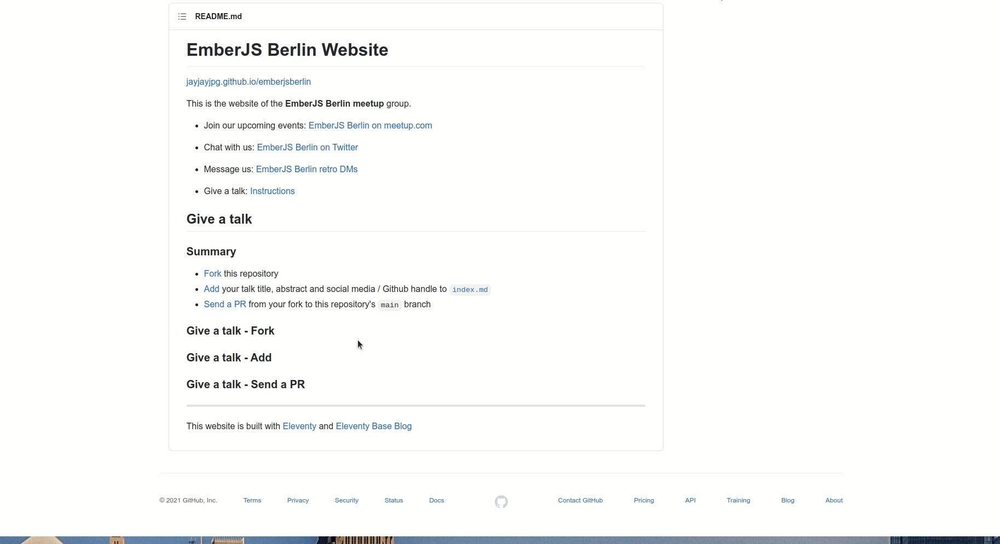
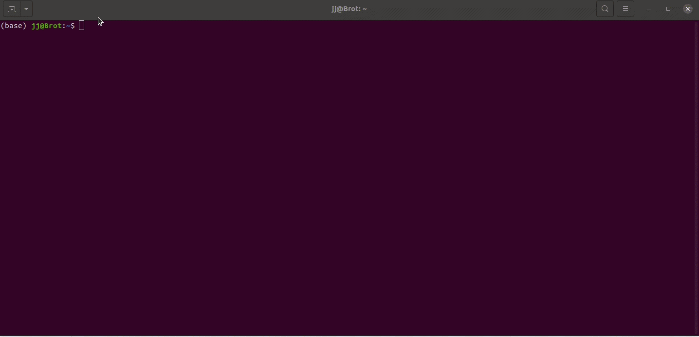

# EmberJS Berlin Website

[jayjayjpg.github.io/emberjsberlin](https://jayjayjpg.github.io/emberjsberlin/)

This is the website of the **EmberJS Berlin meetup** group.

- Join our upcoming events: [EmberJS Berlin on meetup.com](https://www.meetup.com/g/Ember-js-Berlin/)

- Chat with us: [EmberJS Berlin on Twitter](https://twitter.com/emberliners)

- Message us: [EmberJS Berlin retro DMs](mailto:Emberjsberlin@gmail.com)

- Give a talk: [Instructions](#give-a-talk)

## Give a talk

### Summary

- [Fork](#) this repository
- [Add](#) your talk title, abstract and social media / Github handle to [`index.md`](https://github.com/jayjayjpg/emberjsberlin/blob/main/index.md)
- [Send a PR](#) from your fork to this repository's `main` branch

### Give a talk - Fork

- Click the `Fork` button in the menu bar at the top of this repository
- optional (e.g. if you have access to several Github accounts): select the account / organization this  repository should be forked to
- on your forked repository page, click the `Clone` button below the repository tab navigation
- copy the HTTPS url (or SSH url if you have keys set up) from the menu

- In your terminal, type `git clone` followed by the forked repository's url that you copied in the previous step
- navigate into the project's directory: `cd emberjsberlin`
- create a new branch by using `git checkout -b <name of your branch>`
- optional: to review your changes locally, run `npm i && npm start` in your terminal. You should be able to visit the website on http://localhost:8080 in your browser

### Give a talk - Add

### Give a talk - Send a PR

---

This website is built with [Eleventy](https://github.com/11ty/eleventy) and [Eleventy Base Blog](https://github.com/11ty/eleventy-base-blog)
